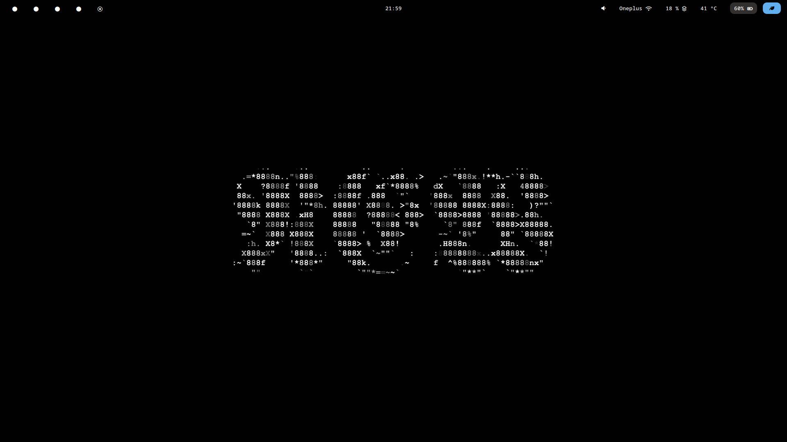
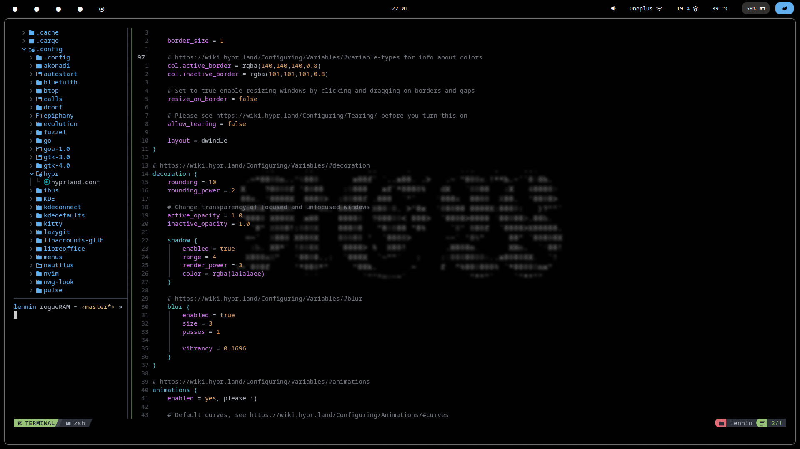
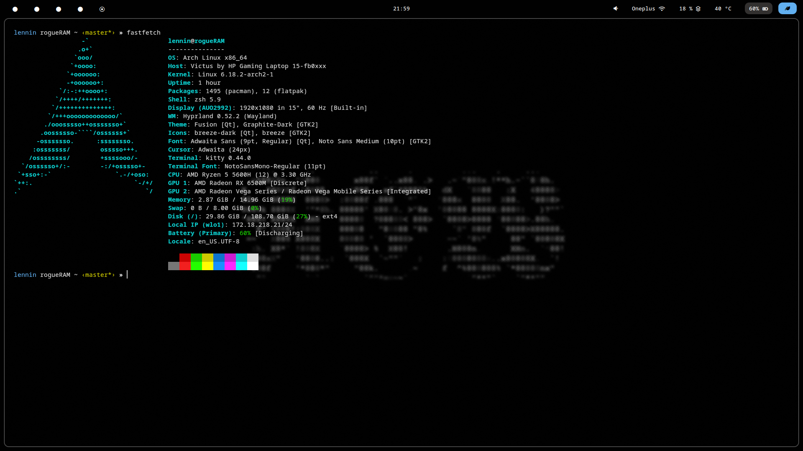

# Arch Linux dotfiles
## This repo contains all dotfiles of 
-nivm (Nv chad)
-kitty terminal
-waybar
-hyprland
-fuzzel (Application runner)

most of the dot file were ignored for being too meh

## Looks like this BTW : 

